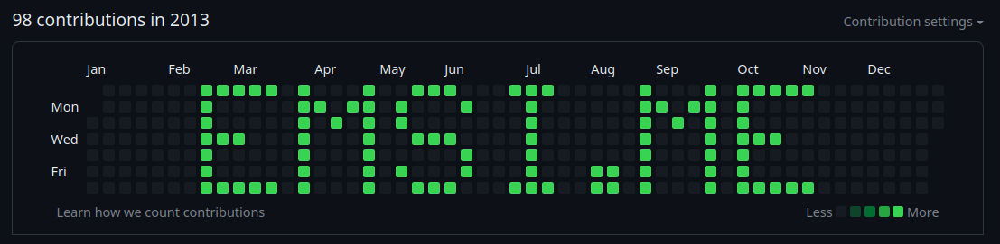
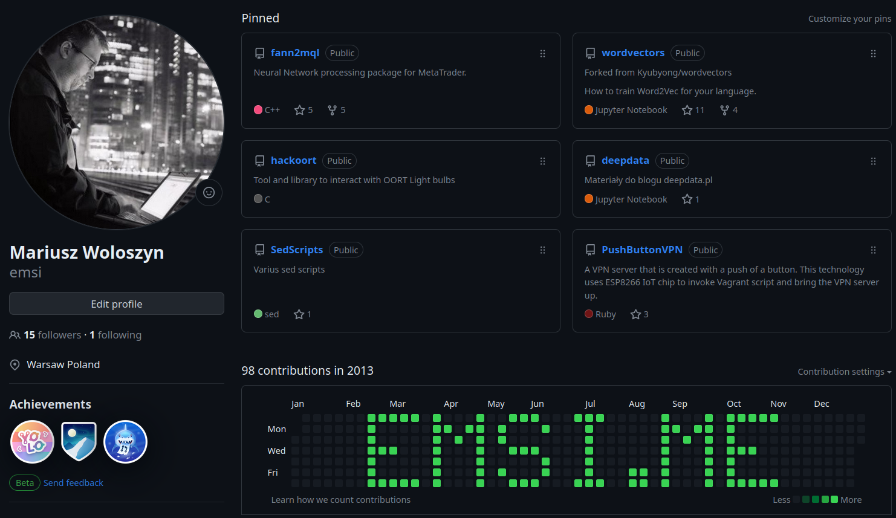

# Banner
This tool helps you create a banner inside your GitHub commit graph, that looks [like this](https://github.com/emsi?tab=overview&from=2013-12-01&to=2013-12-31):



# WARNING
**Due to the way GitHub is rendering the commit graph, a "pixel" once lit cannot be turned off. 
This means that if you make a mistake, it cannot be corrected (deleting commits and force 
pushing or even removing whole repo does not do anything!).**

Your milage may vary, use at your own risk.

**I encourage you to test your banner on a separate account first!**

## How to use
This project is for developers so certain skills are assumed. If you are not a developer, you can 
still use this project, but you will need to do some research on your own.

1. Install requirements (requirements.txt is provided)
2. Run `commit.py --help` in the env with requirements installed
3. Observe the output and act accordingly

```
Usage: commit.py [OPTIONS]

  Generate a banner on the GitHub commit graph

Options:
  --banner-text TEXT   Text to be displayed on the commit graph.  [default:
                       EMSI.ME]
  --date TEXT          Date from which the banner should start in the format:
                       'YYYY-MM-DD'  [default: 2013-02-17]
  --intensity INTEGER  Number of commits per day  [default: 1]
  --help               Show this message and exit.
```

**Don't forget to push your commits to GitHub.**

## Tips
- Test before you go nuts with the banner, it seems the graph uses dates in LA timezone but 
  that might be just impression.
- If you generate the banner at current date it will scroll to the left with time, hence it's 
  better to paint at the [full year boundary](https://github.com/emsi?tab=overview&from=2013-12-01&to=2013-12-31). 
- Uppercase and lowercase letters are implemented but uppercase letters are more visible.
- Besides letters only `#` and `*` are implemented.
- You can use `--intensity` to make the banner more visible (more commits per day), but don't 
  overdo it...
- unless you need to use very high intensity to paint over existing commits (the algorithm for 
  pixel intensity isn't 100% clear to me, if you have dozens or hundreds commits per day, you may 
  need to
  use very high intensity to paint over them, like 10 times more than most intensive pixel).

# Example
